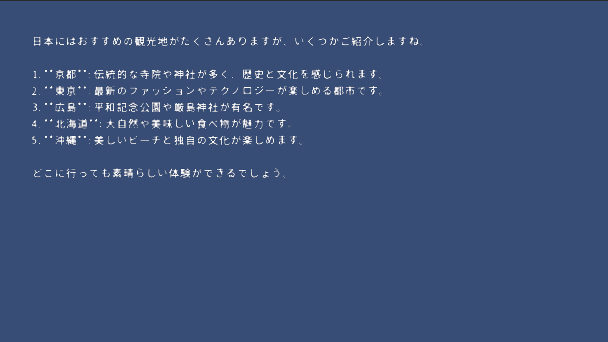

# UniRealtime

UniRealtimeは、OpenAIのRealtime APIをUnityプロジェクトに簡単に統合し、インタラクティブな音声およびテキストベースの対話を実現するためのライブラリです。このライブラリを使えば、低遅延でマルチモーダルなキャラクター対話や、リアルタイムでのAI応答をスムーズに実装できます。

サンプルシーンを含んでいるため、クローンしてすぐに動作を確認できます。また、ライブラリとしてプロジェクトに組み込むことも可能です。

<!-- TOC -->
* [uni-realtime](#uni-realtime)
* [機能概要](#機能概要)
* [サンプルプロジェクトのセットアップ](#サンプルプロジェクトのセットアップ)
* [対応するOpenAIのAPI機能](#対応するopenaiのapi機能)
* [ライブラリとしての使用方法](#ライブラリとしての使用方法)
  * [依存ライブラリのインストール](#依存ライブラリのインストール)
  * [Unity Package Manager (UPM)](#unity-package-manager-upm)
  * [Unity Package](#unity-package)
* [動作環境](#動作環境)
* [依存関係](#依存関係)
* [サンプルの使用方法](#サンプルの使用方法)
* [License](#license)
<!-- TOC -->機能概要
* 低遅延の音声対話: OpenAI Realtime APIを活用し、リアルタイムでキャラクターと音声対話が可能。
* マルチモーダル対応: テキストおよび音声の双方向入力/出力に対応。
* 音声合成: 自然で感情豊かな音声応答を提供。
* WebSocket通信: WebSocketによる高効率かつ低遅延な双方向通信を実現。

# サンプルプロジェクトのセットアップ
* 以下は、Unityを使ったプロジェクトでOpenAIのRealtime APIを利用するためのサンプルシーンのセットアップ手順です。

1. OpenAI APIにアクセスして、APIキーを取得。
2. Unityでプロジェクトを開きます。
3. `Assets/UniRealtime/Sample/Scenes` にあるRealtimeAIDemoシーンを開きます。
4. OpenAIのAPIキーをプロジェクト内で設定します。

実行することで以下の画像のように動作します。

# 対応するOpenAIのAPI機能
* Text & Audio Input/Output: テキストと音声の入出力に対応し、インタラクティブな音声会話を実現。
* Function Calls: AIモデルによるリアルタイムの関数実行機能。
* 自然な音声出力: 語調や自然な音声のインタラクションが可能、低遅延でシームレスな対話を提供。

# ライブラリとしての使用方法

## 依存ライブラリのインストール

## Package Manager
1. Package Managerを開きます。
2. `+` ボタンをクリックし、`Add package from git URL` を選択します。
3. `https://github.com/ayutaz/UniRealtime.git?path=/Assets/UniRealtime/Scripts`

## Unity Package
1. UniTaskおよびunity-websocketをインストールします。
2. リリースページから最新のUnityパッケージをダウンロードします。
3. ダウンロードしたUnityパッケージをプロジェクトにインポートします。

# 動作環境
* Unity: 2021.3.14f1 以降
* OpenAI Realtime API: 最新のAPIバージョンに対応
* WebSocket: 高速WebSocket通信に対応

# 依存関係
* [UniTask](https://github.com/Cysharp/UniTask)
* [unity-websocket](https://github.com/mikerochip/unity-websocket)

# サンプルの使用方法
* サンプルには、音声入力からAI応答、さらにリアルタイムでの音声合成までを行うシンプルなキャラクター対話システムが含まれています。以下のステップで利用可能です。
* マイクや他の入力デバイスを用いて音声をリアルタイムで取得。
* 音声やテキストをOpenAI Realtime APIに送り、応答を受信。
* Unity内のキャラクターに応答させることで、インタラクティブな対話が可能。

# License
このプロジェクトはApache-2.0ライセンスの条件下で提供されています。詳細はLICENSEファイルを参照してください。

ただしサンプルシーンに使用しているFontは、[Google Fonts](https://fonts.google.com/)の[NotoSansJP](https://fonts.google.com/noto/specimen/Noto+Sans+JP)を使用しています。Noto Sans JPは[ASIL Open Font License, Version 1.1](https://openfontlicense.org/open-font-license-official-text/)の下で提供されています。