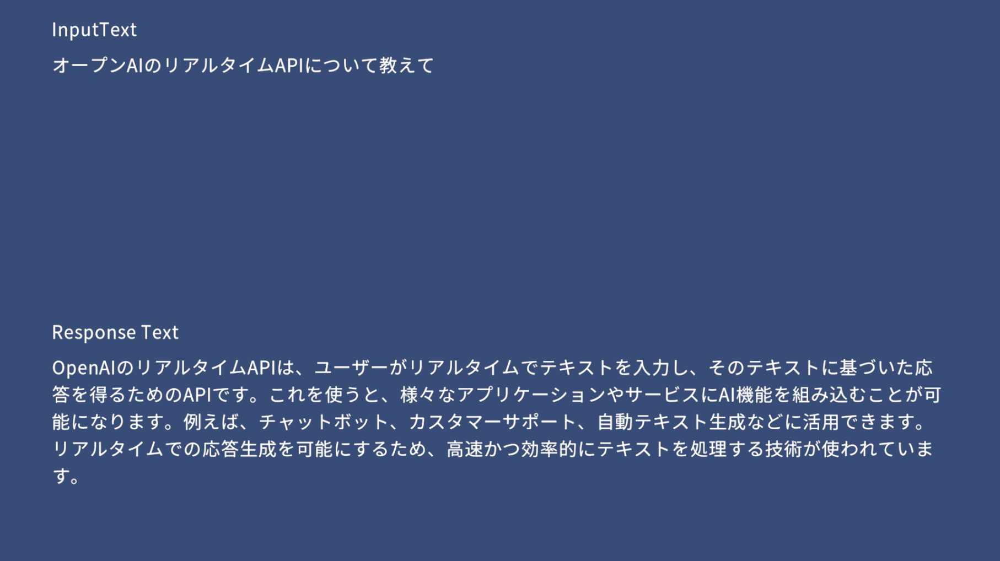

# UniRealtime

[日本語](README_JP.md) | English

UniRealtime is a library that simplifies the integration of OpenAI's Realtime API into Unity projects, enabling interactive voice and text-based conversations. With this library, you can smoothly implement low-latency, multimodal character interactions and real-time AI responses.

Since it includes sample scenes, you can clone it and check its operation immediately. It is also possible to incorporate it into your project as a library.

<!-- TOC -->
* [UniRealtime](#unirealtime)
* [Setup of the Sample Project](#setup-of-the-sample-project)
* [How to Use as a Library](#how-to-use-as-a-library)
  * [Installing Dependent Libraries](#installing-dependent-libraries)
  * [Package Manager](#package-manager)
  * [Unity Package](#unity-package)
* [Operating Environment](#operating-environment)
* [How to Use the Sample](#how-to-use-the-sample)
* [License](#license)
<!-- TOC -->

# Setup of the Sample Project
* The following are the setup steps for the sample scene to use the OpenAI Realtime API in a Unity project.

1. Access the OpenAI API and obtain your API key.
2. Open the project in Unity.
3. Open the `RealtimeAIDemo` scene located in `Assets/UniRealtime/Sample/Scenes`.
4. Set your OpenAI API key within the project.

By running the project, it will operate as shown in the image below.

# How to Use as a Library

## Installing Dependent Libraries

1. Install [unity-websocket](https://github.com/mikerochip/unity-websocket)

2. Optionally, install [UniTask](https://github.com/Cysharp/UniTask). If you do not use this, internal processing will use `Task`.

## Package Manager
1. Open the Package Manager.
2. Click the `+` button and select `Add package from git URL`.
3. Enter `https://github.com/ayutaz/UniRealtime.git?path=/Assets/UniRealtime/Scripts`

## Unity Package
1. Install UniTask and unity-websocket.
2. Download the latest Unity package from the Releases page.
3. Import the downloaded Unity package into your project.

# Operating Environment
* Unity: 2021.3.14f1 or later
* OpenAI Realtime API: Compatible with the latest API version

# How to Use the Sample
* The sample includes a simple character interaction system that performs voice input, AI response, and real-time speech synthesis. It can be used with the following steps.
* Use a microphone or other input device to capture audio in real time.
* Send audio or text to the OpenAI Realtime API and receive responses.
* By having the character within Unity respond, interactive conversations are possible.

# License
This project is provided under the terms of the Apache-2.0 license. See the LICENSE file for details.

However, the font used in the sample scene is [Noto Sans JP](https://fonts.google.com/noto/specimen/Noto+Sans+JP) from [Google Fonts](https://fonts.google.com/). Noto Sans JP is provided under the [SIL Open Font License, Version 1.1](https://openfontlicense.org/open-font-license-official-text/).
